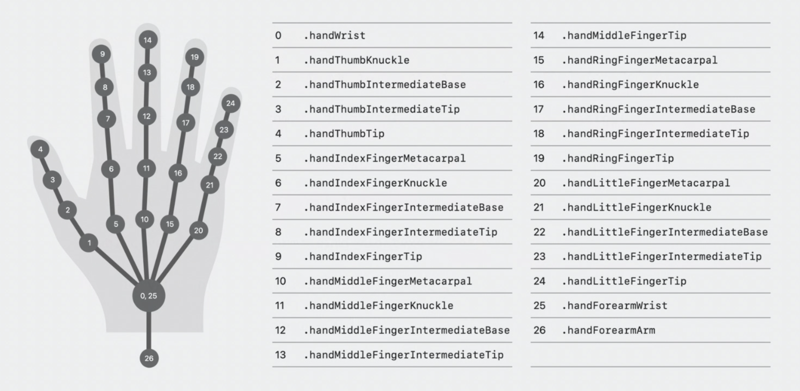
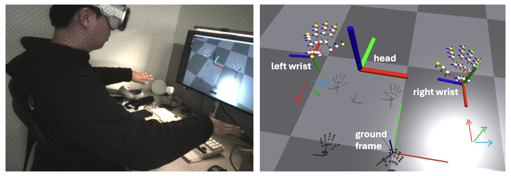
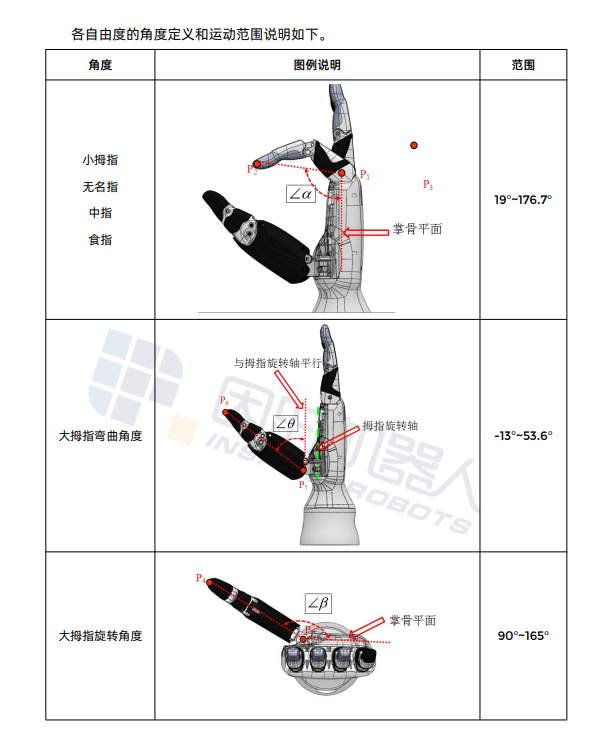

## Introduction

六自由度因时灵巧手的 retargeting 。

玩具代码，线性映射，耗费计算量小。

更通用的 retarget 等我九月底把项目完善以后一起发出来。

## Related Projects

<a href="https://github.com/Improbable-AI/VisionProTeleop">VisionProTeleop</a>

<a href="https://yzqin.github.io/anyteleop/">AnyTeleop</a>

更高自由度的灵巧手 retargeting 项目：
<a href="https://github.com/dexsuite/dex-retargeting/">dex-retargeting</a>

## 输入数据

参考 VisionProTeleop 的 app，从 visionpro 获得关节数据。

<!--
关节约定：



数据类型：

```python
r['head']: np.ndarray
  # shape (1,4,4) / measured from ground frame
r['right_wrist']: np.ndarray
  # shape (1,4,4) / measured from ground frame
r['left_wrist']: np.ndarray
  # shape (1,4,4) / measured from ground frame
r['right_fingers']: np.ndarray
  # shape (25,4,4) / measured from right wrist frame
r['left_fingers']: np.ndarray
  # shape (25,4,4) / measured from left wrist frame
r['right_pinch_distance']: float
  # distance between right index tip and thumb tip
r['left_pinch_distance']: float
  # distance between left index tip and thumb tip
r['right_wrist_roll']: float
  # rotation angle of your right wrist around your arm axis
r['left_wrist_roll']: float
 # rotation angle of your left wrist around your arm axis
```

参考系约定：



使用方式：

```python
from avp_stream import VisionProStreamer
avp_ip = "10.31.181.201"   # example IP
s = VisionProStreamer(ip = avp_ip, record = True)

while True:
    r = s.latest
    print(r['head'], r['right_wrist'], r['right_fingers'])
``` -->

## retargeting

根据因时手角度的定义，除开大拇指外的四个指头，由三个关节点之间的角度确定————指尖，指根，掌骨平面。计算人手这三个关节点之间的角度，然后直接线性映射到机械手的输入里。因时手文档我放在 assets 文件夹里了，可以参考。

大拇指两个自由度的控制方式类似，均是线性映射，只是取的点不同。



主要逻辑：

大部分情况下直接计算人手关节角度输入给机械手，四根手指各计算一个角度，大拇指计算两个角度。

当拇指和食指尖距离接近的时候进入 pinch 模式，固定大拇指旋转角度到食指尖的方向，角度根据 pinch_distance 计算。

## 输出数据

发送 UDP 给灵巧手。在 communication.py 里面，ip 需要调整为你的灵巧手的 ip。
